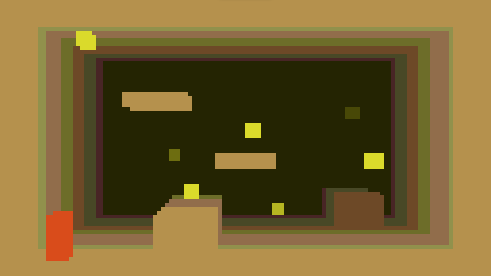

# In the Pipes

3D retro platformer game demo in vanilla JavaScript.

[Play Now](https://bradharms.github.io/inthepipes-game)

> **NOTE:** For best results, play in the browser's full-screen mode on a 16:9 screen.

## How to Play

This app requires no build tools or local software other than a common, modern web browser. Chrome-based browsers are preferred, but other browsers should also work.

You can click the link above to run the current source code directly in the current browser window. Alternatively, to run the app from your own device, download or clone all files and open `index.html` in a web browser.

> **NOTE:** See [Same Origin Policy](#same-origin-policy) for details about running the demo directly from the filesystem.

### Controls

Keyboard and Xbox One controllers are both supported. (Other types of joysticks or gamepads will also work but the button mappings will be different.)

#### Keyboard Controls

- **Left, Right, Up, Down**: Walk.
- **Space**: Jump. Hold longer to jump higher.

#### Xbox One Controls

- **D-Pad**: Walk.
- **X**: Jump. Hold longer to jump higher.

### Objectives

No objectives are currently set except to collect all coins in the room. In the future, additional objectives and features will be added to facilitate an exploration, survival, puzzle-solving experience.

## Editor

The demo features a built-in level editor which can be activated by pressing number keys on the keyboard and by clicking the screen:

- `0`: Default mode. Left click is ignored.
- `1`: Player edit mode. Left click to set the player's current location to the place you clicked.
- `2`: Wall edit mode. Left click to begin drawing a wall, starting from the top-left corner. Drag down and/or right to expand the wall from the point clicked. Release to finalize the wall.
- `3`: Coin edit mode. Left click to place a coin.
- Additionally, right clicking any element will delete it (other than the player).

Currently, objects can only be placed on the front-most layer. (A method for 3D object placement has yet to be devised.)

## Same-Origin Policy

By default most browser's default same-origin policy will prevent loading the JavaScript files from a page loaded directly off the local filesystem using the `file://` protocol, which will prevent the demo from running at all. To get around this, change browser flags so that it will allow pages loaded from the `file://` protocol to load other resources from other files in the same directory. Alternatively, serve project files using a local HTTP server so that the browser will see the files as coming from the `http://` protocol rather than the `file://` protocol.

## Software Architecture Style

Code is organized somewhat loosely into ECMA modules based on major game features. Code is primarily procedural and state-oriented, meaning object-oriented, functional, and stateless techniques are avoided whenever possible. For example, there are no classes defined anywhere, and stateful loops are used even when array comprehensions could be used. This is very different from the style of programming used in most modern web sites and frameworks.

The main reason for the choice of coding style is somewhat indirectly related to performance. Even though modern web development practices could be used, such styles typically aren't used for game engines, which traditionally have had very high performance-to-cost ratio requirements. There is also a tremendous amount of interaction between state segments in this type of game, and modern web practices generally add a large amount of computational and psychological overhead to that kind of interaction. Furthermore, I wanted to focus mainly on techniques that could be used in the most limited of languages without any major architectural changes. Ideally, every aspect of the program not explicitly tied to the browser (such as keyboard events, request animation frames, and the canvas API) could be translated into pure assembly code with a similar organizational structure.

Code ie executed directly in the browser as-is without any preprocessing steps. That being said, JSDoc type information is used heavily in conjunction with embedded TypeScript type information in order to "strongly" type everything. However, other than error highlighting provided by Microsoft Visual Studio Code, no tools are used to enforce type information.

## Memory Management

Of particular note is the codebase's tendency to avoid memory allocation and deallocation as often as possible. This is to avoid the slowdown associated with the act of allocating and deallocating memory, and the avoid depending on JS garbage collection, which wouldn't be available in low-level environments. To achieve this, initialization creates objects in advance of their use and keeps them in pools. Code passes around references to objects in the pools, and marks the objects as being in use or not in various ways depending on the type of object in question.

Additionally, closures are typically avoided whenever possible. For closure-like use cases, module-level variables are used as transports between a caller and callee.

## Rendering

The rendering engine is based on a the pursuit of a unique aesthetic using a few core concepts:

- **Only use basic 2D geometry functions for drawing, even for 3D objects.** (Primarily rectangles.)
- **Use a coordinate system based on a unit that is meaningful to the physics engine: Grid cells.**
- **Use the lowest resolution possible.** Canvas resolution based on the number of pixels in a cell, not the other way around.**
- **Represent colors in the lowest bit depth possible.** Currently, color is represented using 9-bit color (3 bits per color channel) for every object drawn to the screen, and no alpha transparency is used. Lighting effects are achieved by choosing a different color for a rectangle out of the possible 9-bit color palette based on distance from the camera and the object's "base" color.

## Physics

The physics engine is based on AABB cubes and cubic intersection math. The collision resolution algorithm uses techniques that assume that all objects have axis-aligned bounding boxes.

There are limited forces at play on any given object. Player vertical movement uses a current vertical velocity value. A simple force of gravity changes velocity over time. Jumping is achieved simply by setting the player's vertical velocity to a specific value. Horizontal movement on the x and z axises is achieved by directly changing player position relative to their current position.

There is no universal, central physics controller. Instead, any necessary physics calculations are performed by objects according to what calculations that particular object type should experience, and interactions between objects are also handled by the objects with regard to other objects of specific types. For example, the player logic explicitly checks for collisions with walls, but the coin logic looks for collisions with the player. An update function must be added to the game's main update loop for each type of object.

## TODO

- [ ] Add an NTSC filter effect
- [ ] Add sound based on web audio contexts
- [ ] Enhance the level editor to allow objects to be placed in 3D
- [ ] Add support for saving levels to local filesystem
- [ ] Add support for loading levels from the filesystem
- [ ] Enemies, health, and attacks
- [ ] Camera following
- [ ] Camera boundaries
- [ ] Camera boundary editing in level editor
- [ ] Maintain canvas aspect ratio for all window sizes
- [ ] Find a use for coins
- [ ] Add HUD to show coin count and health
